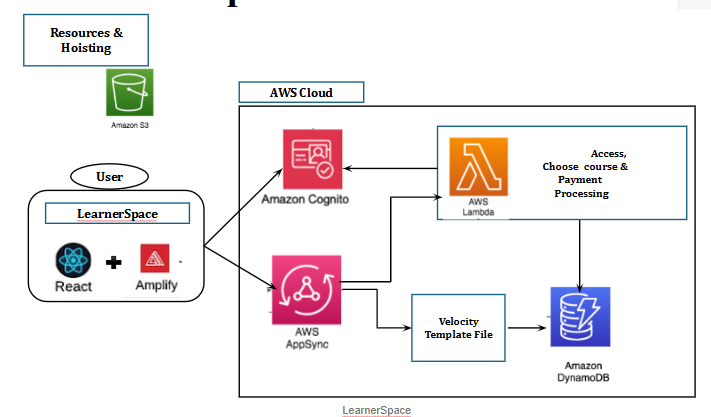

# LearnerSpace - A Serverless Approach for an E-Learning Platform

- Breaking the Conventional Methodology:
- Serverless services enable the developer to focus on the logic of the application.
- Focuses on breaking the architecture into smaller components like microservices architecture

## Objective

- To build a full-stack application for an e-learning platform using serverless services.

## Tech Stack

- Front end – React
- Backend
  - AWS Amplify CLI to provision resources
  - AWS Amplify React Library to connect with AWS resources from the React App.
  - AWS Amplify UI Library.
  - GraphQL API – AWS AppSync
  - Authentication – AWS Incognito
  - Database – AWS DynamoDB
  - Processing Orders and payments – AWS Lambda
  - Storage – AWS S3 for storing course videos and hoisting the static website.
- Payment Processing - Stripe

## Architecture

## Benefits

- Agility
- Elasticity
- Deploy globally in minutes
- Cost Savings - Pay only for what services we use.
- Complete control over the granularity of the application
- Since it’s loosely coupled, the functionalities can be reused.
- Provides scalability and high availability.
